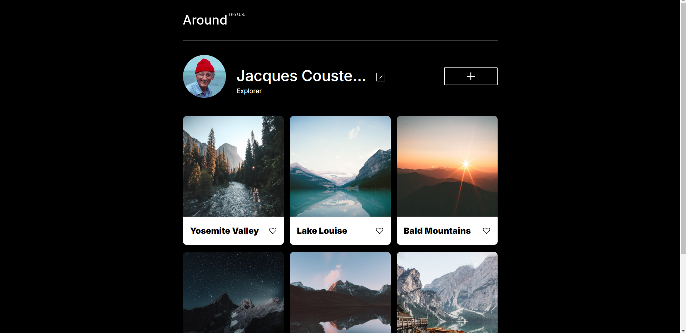
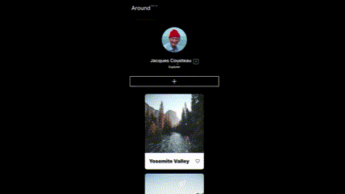
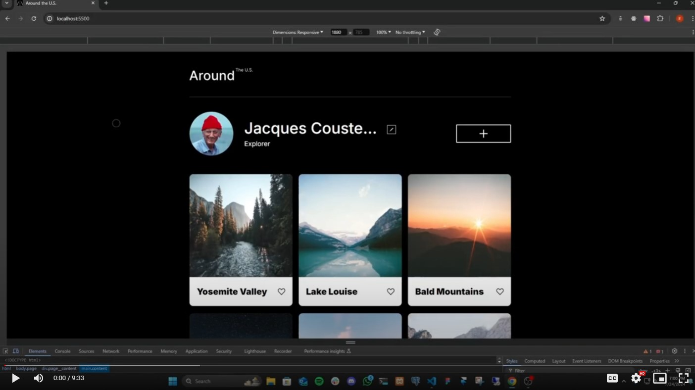

## Table of contents

- [Overview](#overview)
  - [Project Features](#project-features)
  - [Screenshot](#screenshot)
  - [Links](#links)
- [My process](#my-process)
  - [Built with](#built-with)
  - [Description](#description)
- [Author](#author)

## Overview

### Project Features

- Create a responsive website from scratch based on a mockup created using Figma
- Follow a BEM Flat
- Webpage should scale smoothly
- Be able to View the optimal layout for the interface depending on the device's screen size rendering the page
- Use the developer tools to help debug and facilitate the site's responsiveness
- Use CSS Grids and Flex-box to ensure proper and effective responsive behavior
- optimize any and all media used to minimize loading times and increase efficiency

### Screenshot

### Links

- [Github Repo](https://github.com/ericvegax/se_project_aroundtheus/)
- [Live Site URL:](https://ericvegax.github.io/se_project_aroundtheus/)

## My Process

### Built with

- HTML
- CSS
- Grid
- Flex-box

### Requirements:

- Responsive
- Semantic markup
- Use B.E.M. flat file structure
- At least 2 breakpoints:
  - Desktop: 1280px - max width
  - Mobile: 320px - min width
- End result was to match the Figma design spec document

### Description:

This project is a clean profile type website page with a minimalist style to let the content have the floor. The css grid gallery allows the images to display all at once in thumbnail form or in full screen view upon tapping or selecting an image. The user is able to create, update. and delete items in their card gallery as well as update their profile info.

## Author

- Github - [Eric](https://github.com/ericvegax)